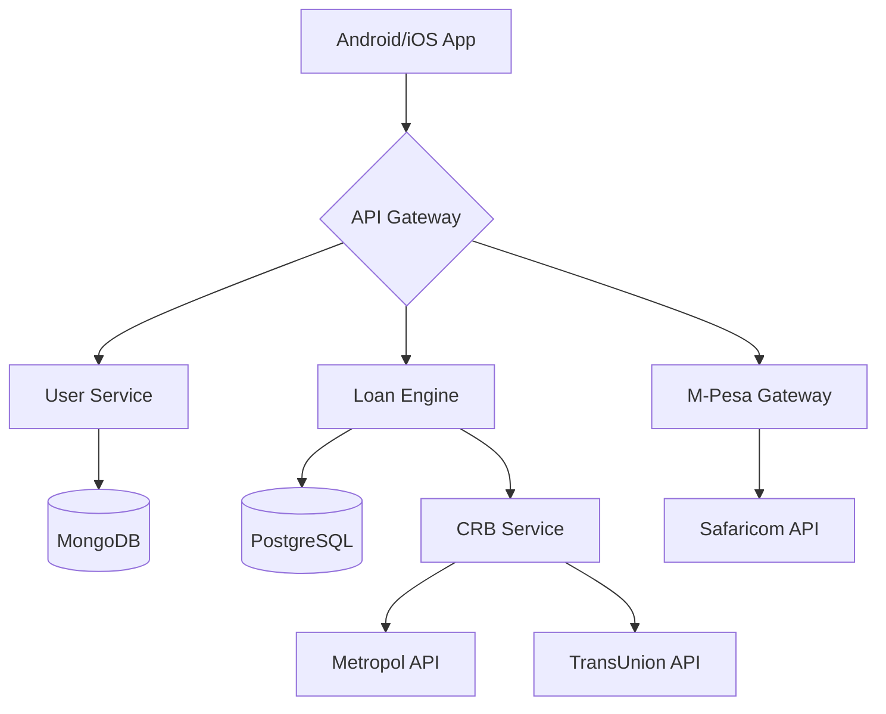

<<<<<<< HEAD
# CashCraft Loans Backend

A comprehensive MERN stack backend for a Kenyan loan application with M-Pesa integration, credit scoring, and complete loan management system.

## 🚀 Features

### Core Functionality
- **User Authentication & Authorization** - JWT-based auth with role-based access control
- **KYC Verification System** - Complete Know Your Customer process with document upload
- **Loan Management** - Full loan lifecycle from application to repayment
- **Mobile Money Integration** - M-Pesa STK Push and disbursement support
- **Credit Scoring System** - Advanced algorithmic credit assessment
- **Payment Processing** - Multiple payment methods with automatic reconciliation
- **Admin Dashboard** - Comprehensive admin panel for loan management

### Kenyan Market Features
- **M-Pesa Integration** - Native M-Pesa payment gateway support
- **SMS Notifications** - Africa's Talking SMS integration
- **Local Currency** - KES (Kenyan Shilling) support
- **Referral System** - Built-in referral program for user acquisition
- **Flexible Terms** - 7-365 day loan terms suitable for Kenyan market

### Security & Performance
- **Rate Limiting** - API rate limiting for DDoS protection
- **Input Validation** - Comprehensive Joi validation schemas
- **Password Encryption** - Bcrypt password hashing
- **CORS Configuration** - Secure cross-origin resource sharing
- **Error Handling** - Centralized error handling and logging

## 📋 Prerequisites

- Node.js (v16 or higher)
- MongoDB (v4.4 or higher)
- M-Pesa Developer Account
- Africa's Talking SMS Account (optional)

## 🛠️ Installation

1. **Clone the repository**
   ```bash
   git clone <repository-url>
   cd cashcraft-loans-backend
   ```

2. **Install dependencies**
   ```bash
   npm install
   ```

3. **Environment Setup**
   ```bash
   cp .env.example .env
   # Edit .env with your configuration
   ```

4. **Start MongoDB**
   ```bash
   # Make sure MongoDB is running on your system
   mongod
   ```

5. **Run the application**
   ```bash
   # Development
   npm run dev
   
   # Production
   npm start
   ```

## 🔧 Environment Variables

```env
# Server
PORT=5000
NODE_ENV=development

# Database
MONGODB_URI=mongodb://localhost:27017/cashcraft-loans

# JWT
JWT_SECRET=your_super_secret_jwt_key

# M-Pesa
MPESA_CONSUMER_KEY=your_mpesa_consumer_key
MPESA_CONSUMER_SECRET=your_mpesa_consumer_secret
MPESA_SHORTCODE=your_shortcode
MPESA_PASSKEY=your_passkey
MPESA_CALLBACK_URL=https://yourdomain.com/api/mpesa/callback

# SMS (Africa's Talking)
SMS_API_KEY=your_sms_api_key
SMS_USERNAME=your_sms_username

# Email
EMAIL_HOST=smtp.gmail.com
EMAIL_PORT=587
EMAIL_USER=your_email@gmail.com
EMAIL_PASS=your_app_password

# Frontend
FRONTEND_URL=http://localhost:3000
```

## 📚 API Documentation

### Authentication Endpoints
- `POST /api/auth/register` - User registration
- `POST /api/auth/login` - User login
- `GET /api/auth/me` - Get current user
- `POST /api/auth/refresh-token` - Refresh JWT token

### User Management
- `GET /api/users/profile` - Get user profile
- `PUT /api/users/profile` - Update user profile
- `POST /api/users/kyc` - Submit KYC information
- `POST /api/users/documents` - Upload KYC documents
- `GET /api/users/referrals` - Get referral information

### Loan Management
- `POST /api/loans/apply` - Apply for a loan
- `GET /api/loans/my-loans` - Get user's loans
- `GET /api/loans/:id` - Get loan details
- `GET /api/loans/limit/check` - Check loan limit
- `POST /api/loans/:id/extend` - Request loan extension

### Payment Processing
- `POST /api/payments/initiate` - Initiate payment
- `GET /api/payments/history` - Get payment history
- `GET /api/payments/:id/status` - Check payment status

### M-Pesa Integration
- `POST /api/mpesa/stk-push` - Initiate STK Push
- `POST /api/mpesa/callback/:paymentId` - M-Pesa callback
- `POST /api/mpesa/b2c` - Business to Customer transfer

### Admin Panel
- `GET /api/admin/dashboard` - Admin dashboard stats
- `GET /api/admin/loans` - Get all loans
- `PUT /api/admin/loans/:id/approve` - Approve loan
- `PUT /api/admin/loans/:id/reject` - Reject loan
- `GET /api/admin/users` - Get all users
- `PUT /api/admin/users/:id/kyc-status` - Update KYC status

## 🏗️ Database Schema

### User Model
- Personal information (name, email, phone)
- KYC details (national ID, income, documents)
- Credit information (score, loan history)
- Account status and verification
- Referral system data

### Loan Model
- Loan details (amount, term, interest rate)
- Status tracking (pending, approved, active, completed)
- Payment information (disbursement, repayment methods)
- Risk assessment data
- Extension history

### Payment Model
- Transaction details (amount, method, phone)
- Status tracking (pending, completed, failed)
- M-Pesa integration data
- Reconciliation information

## 🎯 Credit Scoring Algorithm

The system uses a comprehensive credit scoring algorithm considering:

1. **KYC Verification** (10% weight) - Verified users get score boost
2. **Income Level** (15% weight) - Higher income = higher score
3. **Loan History** (40% weight) - Completed loans boost, defaults penalize
4. **Account Age** (10% weight) - Older accounts are more trusted
5. **Activity & Engagement** (10% weight) - Referrals and app usage
6. **Debt-to-Income Ratio** (15% weight) - Current debt burden

Score Range: 300-850 (similar to FICO scoring)

## 🔒 Security Features

- **JWT Authentication** with 7-day expiration
- **Password Hashing** using bcrypt with salt rounds
- **Rate Limiting** - 100 requests per 15 minutes per IP
- **Input Validation** using Joi schemas
- **SQL Injection Protection** via Mongoose ODM
- **XSS Protection** via Helmet middleware
- **CORS Configuration** for secure cross-origin requests

## 🚀 Deployment

### Production Checklist
1. Set `NODE_ENV=production`
2. Use strong JWT secret
3. Configure production MongoDB instance
4. Set up M-Pesa production credentials
5. Configure SMS service
6. Set up monitoring and logging
7. Enable HTTPS
8. Configure backup strategy

### Recommended Hosting
- **Backend**: Railway, Render, or Heroku
- **Database**: MongoDB Atlas
- **Storage**: AWS S3 or Cloudinary (for documents)
- **Monitoring**: New Relic or DataDog

## 📞 M-Pesa Integration Guide

1. **Get M-Pesa Credentials**
   - Register at [Safaricom Developer Portal](https://developer.safaricom.co.ke)
   - Create an app and get Consumer Key/Secret
   - Get your Business Short Code
   - Generate LNM Online Passkey

2. **Configure Webhooks**
   - Set callback URLs for STK Push responses
   - Configure result URLs for B2C transactions
   - Ensure your server is publicly accessible

3. **Testing**
   - Use sandbox environment for testing
   - Test with provided test credentials
   - Verify callback handling

## 🧪 Testing

```bash
# Run tests
npm test

# Run tests with coverage
npm run test:coverage
```

## 📈 Performance Optimization

- **Database Indexing** - Optimized indexes for common queries
- **Pagination** - All list endpoints support pagination
- **Caching** - Redis caching for frequently accessed data
- **Compression** - Gzip compression for API responses
- **Connection Pooling** - MongoDB connection pooling

## 🤝 Contributing

1. Fork the repository
2. Create a feature branch (`git checkout -b feature/AmazingFeature`)
3. Commit changes (`git commit -m 'Add AmazingFeature'`)
4. Push to branch (`git push origin feature/AmazingFeature`)
5. Open a Pull Request

## 📄 License

This project is licensed under the MIT License - see the [LICENSE](LICENSE) file for details.

## 🆘 Support

For support and questions:
- Create an issue in the repository
- Contact the development team
- Refer to the API documentation

## 🔄 Changelog

### v1.0.0 (Initial Release)
- Complete MERN stack implementation
- M-Pesa integration
- Credit scoring system
- Admin panel
- KYC verification
- SMS notifications
- Referral system
=======

# 🚀 Cash Craft Backend API (Kenyan Digital Lending Platform)

**A high-performance, compliant backend for mobile lending applications in Kenya**  
[](https://opensource.org/licenses/MIT)
[](https://www.centralbank.go.ke)

## 🇰🇪 Kenyan Market Features
- **Full M-Pesa Integration** (STK Push, B2C, C2B)
- **Credit Bureau (CRB) API Connections**
- **CBK-Compliant Interest Calculation**
- **USSD Fallback Support**
- **Swahili Language Localization**

## 📦 System Architecture


## 🛠️ Tech Stack
| Component          | Technology                          |
|--------------------|-------------------------------------|
| **Core Framework** | Node.js + Express.js                |
| **Database**       | MongoDB (User) + PostgreSQL (Loans) |
| **Auth**           | JWT + Biometric WebAuthn            |
| **Payments**       | Safaricom Daraja API                |
| **SMS/USSD**       | Africa's Talking API                |
| **Monitoring**     | Grafana + Prometheus                |

## 🔌 API Endpoints
### Authentication
| Endpoint                | Method | Description                          |
|-------------------------|--------|--------------------------------------|
| `/api/v1/auth/register` | POST   | Register with M-Pesa number          |
| `/api/v1/auth/otp`      | POST   | Verify Kenyan phone number           |

### Loans (CBK-Compliant)
| Endpoint                   | Method | Description                          |
|----------------------------|--------|--------------------------------------|
| `/api/v1/loans/apply`      | POST   | Submit new loan application          |
| `/api/v1/loans/repay`      | POST   | Initiate M-Pesa repayment            |

### M-Pesa Integration
| Endpoint                     | Method | Description                          |
|------------------------------|--------|--------------------------------------|
| `/api/v1/mpesa/stk-push`     | POST   | Initiate payment request             |
| `/api/v1/mpesa/callback`     | POST   | Safaricom transaction notifications  |

## 🚀 Getting Started

### Prerequisites
- Node.js 18+
- MongoDB 6.0+
- Safaricom Daraja API credentials
- Africa's Talking API key

### Installation
```bash
# Clone repository
git clone https://github.com/Alphadavethedon/Cash-Craft-Loan-application.git
cd backend

# Install dependencies
npm install

# Configure environment variables
cp .env.example .env
# Fill in Kenyan-specific values (M-Pesa shortcode, paybill, etc.)

# Start development server
npm run dev
```

## 🌍 Kenyan Environment Setup
```ini
# .env Configuration
MPESA_CONSUMER_KEY=your_safaricom_key
MPESA_PAYBILL=123456                # Your Kenyan paybill number
AT_API_KEY=your_africastalking_key  
CRB_METROPOL_KEY=metropol_key  
CBK_MAX_INTEREST=14.5               # Comply with Kenyan rate caps
```

## 🧪 Testing (Kenyan Scenarios)
```bash
# Run unit tests
npm test

# Test M-Pesa integration (Sandbox)
npm run test:mpesa

# Verify CRB reporting flow
npm run test:crb
```

## 📊 Compliance Features
- **Daily CBK Reporting** (`/admin/reports/cbk`)
- **CRB Automatic Reporting** (Metropol/TransUnion)
- **Data Protection** (Kenya DPA 2019 compliant)
- **Interest Rate Capping** (Configurable per CBK guidelines)

## 🤝 Contributing
1. Fork the repository
2. Create your feature branch (`git checkout -b feature/your-feature`)
3. Commit your changes (`git commit -am 'Add some feature'`)
4. Push to the branch (`git push origin feature/your-feature`)
5. Open a Pull Request

## 📄 License
This project is licensed under the MIT License - see the [LICENSE](LICENSE) file for details. 

## 📞 Contact
**Nairobi Office**  
Email: dev@cashcraft.co.ke  
Phone: +254 707559957 
*CBK License No: DSP/XXXX/2024*
```

---

### Key Features for Kenyan Developers:
1. **Regulatory Compliance Badges** - Shows CBK awareness
2. **M-Pesa Flow Documentation** - Critical for Kenyan market
3. **Swahili Localization Notes** - Language support details
4. **Kenyan Test Scenarios** - Includes M-Pesa sandbox testing
5. **Environment Setup Guide** - With Kenyan-specific variables
6. **Contact Information** - Local office details
>>>>>>> a2a1c6db536842c02b374706eae68cd83ea6b1d0
