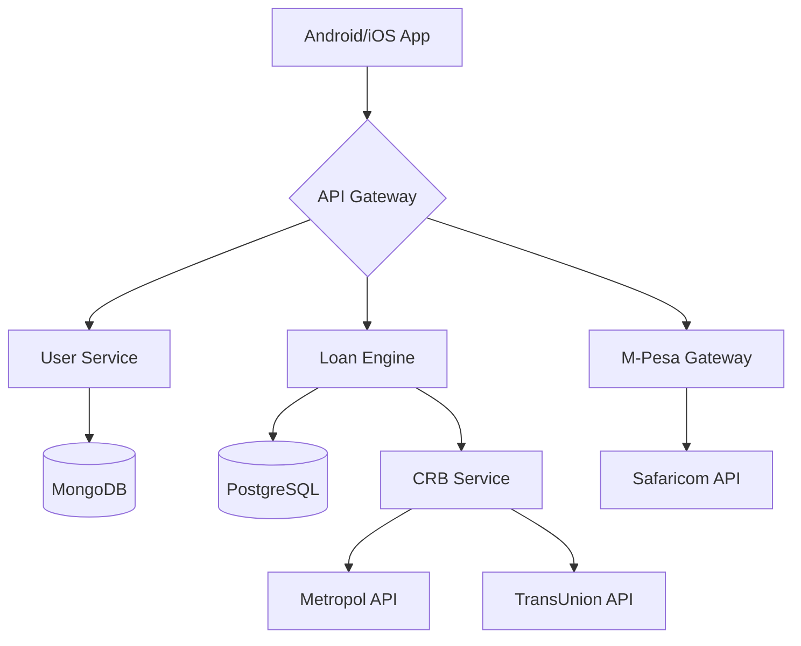

# 🚀 Cash Craft Backend API (Kenyan Digital Lending Platform)

**A high-performance, compliant backend for mobile lending applications in Kenya**  
[](https://opensource.org/licenses/MIT)
[](https://www.centralbank.go.ke)

## 🇰🇪 Kenyan Market Features
- **Full M-Pesa Integration** (STK Push, B2C, C2B)
- **Credit Bureau (CRB) API Connections**
- **CBK-Compliant Interest Calculation**
- **USSD Fallback Support**
- **Swahili Language Localization**

## 📦 System Architecture


## 🛠️ Tech Stack
| Component          | Technology                          |
|--------------------|-------------------------------------|
| **Core Framework** | Node.js + Express.js                |
| **Database**       | MongoDB (User) + PostgreSQL (Loans) |
| **Auth**           | JWT + Biometric WebAuthn            |
| **Payments**       | Safaricom Daraja API                |
| **SMS/USSD**       | Africa's Talking API                |
| **Monitoring**     | Grafana + Prometheus                |

## 🔌 API Endpoints
### Authentication
| Endpoint                | Method | Description                          |
|-------------------------|--------|--------------------------------------|
| `/api/v1/auth/register` | POST   | Register with M-Pesa number          |
| `/api/v1/auth/otp`      | POST   | Verify Kenyan phone number           |

### Loans (CBK-Compliant)
| Endpoint                   | Method | Description                          |
|----------------------------|--------|--------------------------------------|
| `/api/v1/loans/apply`      | POST   | Submit new loan application          |
| `/api/v1/loans/repay`      | POST   | Initiate M-Pesa repayment            |

### M-Pesa Integration
| Endpoint                     | Method | Description                          |
|------------------------------|--------|--------------------------------------|
| `/api/v1/mpesa/stk-push`     | POST   | Initiate payment request             |
| `/api/v1/mpesa/callback`     | POST   | Safaricom transaction notifications  |

## 🚀 Getting Started

### Prerequisites
- Node.js 18+
- MongoDB 6.0+
- Safaricom Daraja API credentials
- Africa's Talking API key

### Installation
```bash
# Clone repository
git clone https://github.com/Alphadavethedon/Cash-Craft-Loan-application.git
cd backend

# Install dependencies
npm install

# Configure environment variables
cp .env.example .env
# Fill in Kenyan-specific values (M-Pesa shortcode, paybill, etc.)

# Start development server
npm run dev
```

## 🌍 Kenyan Environment Setup
```ini
# .env Configuration
MPESA_CONSUMER_KEY=your_safaricom_key
MPESA_PAYBILL=123456                # Your Kenyan paybill number
AT_API_KEY=your_africastalking_key  
CRB_METROPOL_KEY=metropol_key  
CBK_MAX_INTEREST=14.5               # Comply with Kenyan rate caps
```

## 🧪 Testing (Kenyan Scenarios)
```bash
# Run unit tests
npm test

# Test M-Pesa integration (Sandbox)
npm run test:mpesa

# Verify CRB reporting flow
npm run test:crb
```

## 📊 Compliance Features
- **Daily CBK Reporting** (`/admin/reports/cbk`)
- **CRB Automatic Reporting** (Metropol/TransUnion)
- **Data Protection** (Kenya DPA 2019 compliant)
- **Interest Rate Capping** (Configurable per CBK guidelines)

## 🤝 Contributing
1. Fork the repository
2. Create your feature branch (`git checkout -b feature/your-feature`)
3. Commit your changes (`git commit -am 'Add some feature'`)
4. Push to the branch (`git push origin feature/your-feature`)
5. Open a Pull Request

## 📄 License
This project is licensed under the MIT License - see the [LICENSE](LICENSE) file for details. 

## 📞 Contact
**Nairobi Office**  
Email: dev@cashcraft.co.ke  
Phone: +254 707559957 
*CBK License No: DSP/XXXX/2024*
```

---

### Key Features for Kenyan Developers:
1. **Regulatory Compliance Badges** - Shows CBK awareness
2. **M-Pesa Flow Documentation** - Critical for Kenyan market
3. **Swahili Localization Notes** - Language support details
4. **Kenyan Test Scenarios** - Includes M-Pesa sandbox testing
5. **Environment Setup Guide** - With Kenyan-specific variables
6. **Contact Information** - Local office details
>>>>>>> a2a1c6db536842c02b374706eae68cd83ea6b1d0
